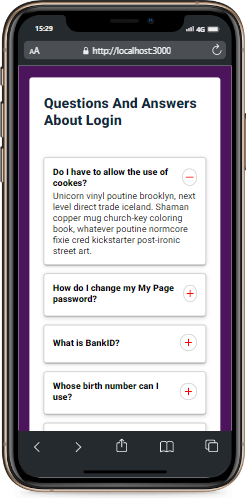
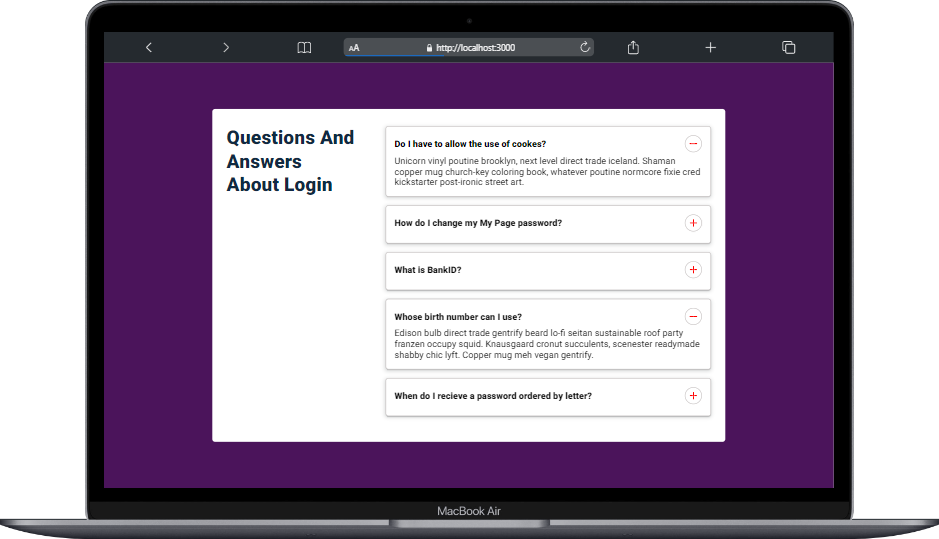

# React volkiaccordion :

### Proje özeti :

> Proje React ile yazıldı temel amaç accordion

### Proje durumu ve yapılacaklar :

- [x] butona tıklandığında ilgili açıklamanın açılması
- [x] buton ikonun değişmesi
- [x] responsive tasarım

### Projede kullanılan Teknolojiler ve Metotlar :

> Projede useState hook kullanıldı.
> stilendirme için herhangi bir kütüphane kullanılmadı pure css ile stilendirme yapıldı.
> context api kullanıldı
> deploy için vercel kullanıldı.

### Proje Adresi

[volkiaccordion](https://volkiaccordion.vercel.app/)

### Projenin Görselleri:

